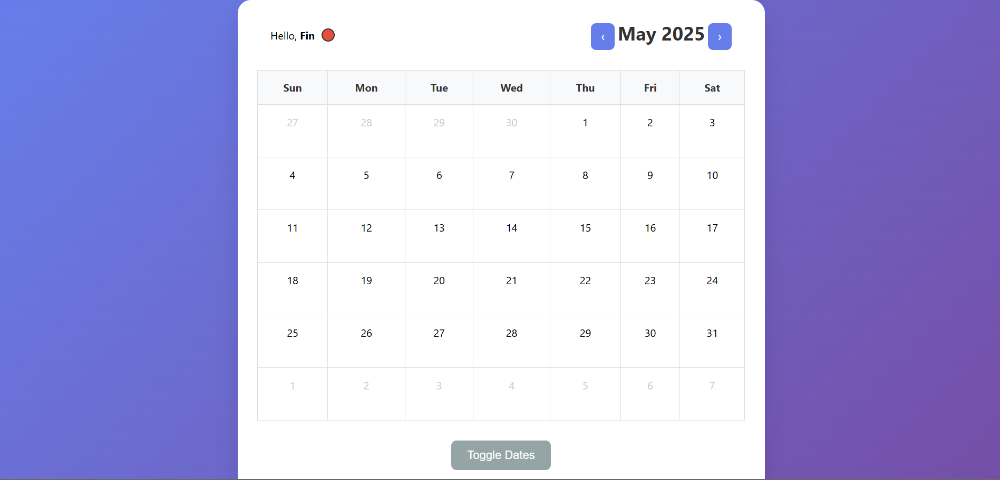

# 📅 Shared Calendar Application

A collaborative calendar application where users can share their availability with others. Perfect for coordinating events, meetings, or group activities where you need to see when everyone is free.



## 🌟 Features

### 🔐 **Secure Authentication**
- **Name-based registration** with unique 4-digit PINs
- **Case-insensitive usernames** (login with "john", "John", or "JOHN")
- **Automatic color assignment** - each user gets a unique color
- **PIN protection** - secure access to personal account

### 🎨 **Visual Calendar Interface**
- **Interactive monthly calendar** with easy navigation
- **Color-coded availability** - each user has their own color
- **Visual feedback** - blue highlights for pending changes
- **Responsive design** - works on desktop and mobile

### 👥 **Collaborative Features**
- **Real-time sharing** - see everyone's availability instantly
- **User color key** - easily identify who's available when
- **Multiple users per date** - see all available people at once
- **Persistent storage** - availability saved across sessions

### ⚡ **Intuitive User Experience**
- **One-click date selection** - simply click dates to toggle
- **Instant visual feedback** - see changes before saving
- **Smart toggle system** - add new dates or remove existing ones
- **Always-ready interface** - no waiting or disabled states

## 🚀 Live Demo

Visit the live application: https://finndude.github.io/Shared-Calendar/

## 🛠️ Technology Stack

- **Frontend**: HTML5, CSS3, Vanilla JavaScript
- **Backend**: Supabase (PostgreSQL database)
- **Hosting**: GitHub Pages
- **Authentication**: Custom PIN-based system
- **Styling**: Modern CSS with responsive design

## 📋 Prerequisites

Before setting up the application, you'll need:

1. **Supabase Account** - [Sign up at supabase.com](https://supabase.com)
2. **GitHub Account** - For hosting on GitHub Pages
3. **Basic knowledge** of HTML/CSS/JavaScript (for customization)

## 🔧 Installation & Setup

### Step 1: Clone the Repository

```bash
git clone https://github.com/finndude/Shared-Calendar
cd shared-calendar
```

### Step 2: Supabase Database Setup

1. **Create a new Supabase project**
2. **Run these SQL commands** in the Supabase SQL editor:

```sql
-- Create users table
CREATE TABLE users (
  id SERIAL PRIMARY KEY,
  name VARCHAR(50) UNIQUE NOT NULL,
  color VARCHAR(7) NOT NULL,
  pin VARCHAR(4) NOT NULL,
  created_at TIMESTAMP DEFAULT NOW()
);

-- Create calendar entries table
CREATE TABLE calendar_entries (
  id SERIAL PRIMARY KEY,
  user_name VARCHAR(50) REFERENCES users(name),
  date DATE NOT NULL,
  color VARCHAR(7) NOT NULL,
  created_at TIMESTAMP DEFAULT NOW()
);

-- Enable Row Level Security (optional but recommended)
ALTER TABLE users ENABLE ROW LEVEL SECURITY;
ALTER TABLE calendar_entries ENABLE ROW LEVEL SECURITY;

-- Create policies for public access (adjust as needed)
CREATE POLICY "Allow all operations" ON users FOR ALL USING (true);
CREATE POLICY "Allow all operations" ON calendar_entries FOR ALL USING (true);
```

### Step 3: Configure Supabase Connection

1. **Get your Supabase credentials** from your project settings
2. **Update `script.js`** with your credentials:

```javascript
// Replace these with your actual Supabase credentials
const SUPABASE_URL = 'https://your-project.supabase.co';
const SUPABASE_ANON_KEY = 'your-anon-key-here';
```

### Step 4: Add Favicon (Optional)

1. **Create an `assets` folder** in your project root
2. **Add your logo files**:
   - `logo.ico` (16x16 or 32x32)
   - `logo-16x16.png`
   - `logo-32x32.png` 
   - `logo-180x180.png`

You can use [favicon.io](https://favicon.io) to generate all sizes from one image.

### Step 5: Deploy to GitHub Pages

1. **Push your code** to a GitHub repository
2. **Go to repository Settings** → Pages
3. **Select source**: Deploy from branch `main`
4. **Your site will be live** at `https://yourusername.github.io/repository-name`

## 📖 How It Works

### User Registration Flow

```
User enters name → Check if name exists (case-insensitive) → 
If exists: Show login screen → 
If new: Assign unique color → Show PIN setup → Create account
```

### Authentication System

- **Case-insensitive usernames**: "John", "john", "JOHN" all refer to same user
- **Unique color assignment**: 20 predefined colors, fallback to random colors
- **4-digit PIN protection**: Secure but simple authentication
- **Persistent sessions**: Stay logged in during browser session

### Calendar Interaction

1. **Click dates** → Blue highlights show pending changes
2. **Click "Toggle Dates"** → Changes save to database
3. **Colored dots appear** → Show permanently saved availability
4. **Blue highlights disappear** → Ready for next selection

### Data Storage

```javascript
// Users table structure
{
  id: number,
  name: string,        // "John" (proper case)
  color: string,       // "#3498db" (hex color)
  pin: string,         // "1234" (4 digits)
  created_at: timestamp
}

// Calendar entries structure
{
  id: number,
  user_name: string,   // Links to users.name
  date: string,        // "2025-05-19" (YYYY-MM-DD)
  color: string,       // User's assigned color
  created_at: timestamp
}
```

## 🎨 Customization

### Color Palette

The application uses 20 predefined colors. To modify them, edit the `USER_COLORS` array in `script.js`:

```javascript
const USER_COLORS = [
    '#e74c3c', // Red
    '#3498db', // Blue
    '#2ecc71', // Green
    // Add your custom colors here
];
```

### Styling

Main CSS classes for customization:

- `.container` - Main application wrapper
- `.calendar` - Calendar table styling
- `.date-dot` - User availability dots
- `.selected` - Temporary selection highlight
- `.user-item` - User list in color key

### PIN Length

To change PIN length, modify the validation in `script.js`:

```javascript
// Change from 4 to your desired length
if (pin.length !== 4) {
    showError('PIN must be exactly 4 digits', 'pinErrorMessage');
    return;
}
```

## 🔒 Security Considerations

### Current Implementation
- **Client-side PIN validation** - PINs stored as plain text
- **Public database access** - Anyone can read/write data
- **No rate limiting** - No protection against spam

### Production Recommendations
1. **Hash PINs** using bcrypt or similar
2. **Implement Row Level Security** in Supabase
3. **Add rate limiting** for API calls
4. **Use environment variables** for sensitive data
5. **Add input sanitization** and validation

### Example PIN Hashing
```javascript
// For production, hash PINs before storing
const hashedPin = await bcrypt.hash(pin, 10);
```

## 🐛 Troubleshooting

### Common Issues

**"Cannot read properties of undefined"**
- Check that all HTML elements have correct IDs
- Ensure Supabase library loads before your script

**Calendar not displaying**
- Verify Supabase credentials are correct
- Check browser console for database connection errors
- Ensure database tables are created properly

**Colors not appearing**
- Check that `calendar_entries` table has `color` column
- Verify user color assignment in database

**Case-insensitive login not working**
- Ensure you're using `.ilike()` instead of `.eq()` for name queries
- Check PostgreSQL version supports ILIKE operator

### Debug Mode

Add debug logging to `script.js`:

```javascript
// Add at top of file
const DEBUG = true;

// Use throughout code
if (DEBUG) console.log('Debug info:', data);
```

## 🤝 Contributing

1. **Fork the repository**
2. **Create a feature branch**: `git checkout -b feature-name`
3. **Make your changes** and test thoroughly
4. **Commit changes**: `git commit -m "Add feature description"`
5. **Push to branch**: `git push origin feature-name`
6. **Create Pull Request**

### Development Guidelines

- **Test on multiple browsers** (Chrome, Firefox, Safari, Edge)
- **Ensure mobile responsiveness**
- **Follow existing code style**
- **Add comments for complex logic**
- **Test database operations thoroughly**


## 🙏 Acknowledgments

- **Supabase** - For the excellent backend-as-a-service platform
- **GitHub Pages** - For free static site hosting
- **MDN Web Docs** - For comprehensive web development documentation

## 📞 Support

If you encounter any issues or have questions:

1. **Check the troubleshooting section** above
2. **Search existing issues** on GitHub
3. **Create a new issue** with detailed information
4. **Include browser console errors** if applicable

## 🔮 Future Enhancements

### Planned Features
- [ ] **Multiple calendars for your group** - Not just a single global calendar, you can have your own and share it
- [ ] **Event creation** - Schedule specific events, not just availability
- [ ] **Time slots** - Hourly availability instead of full days
- [ ] **User profiles** - Avatars and additional information
- [ ] **Email notifications** - Alert users when others update availability
- [ ] **Export functionality** - Download calendar data as CSV/iCal
- [ ] **Admin panel** - Manage users and clean up old data

### Technical Improvements
- [ ] **Offline support** - Progressive Web App functionality
- [ ] **Real-time updates** - WebSocket integration for instant updates
- [ ] **Better mobile UX** - Touch-optimized interactions
- [ ] **Keyboard navigation** - Full accessibility support
- [ ] **Multi-language support** - Internationalization

---

**Built by finndude**

*Last updated: May 2025*